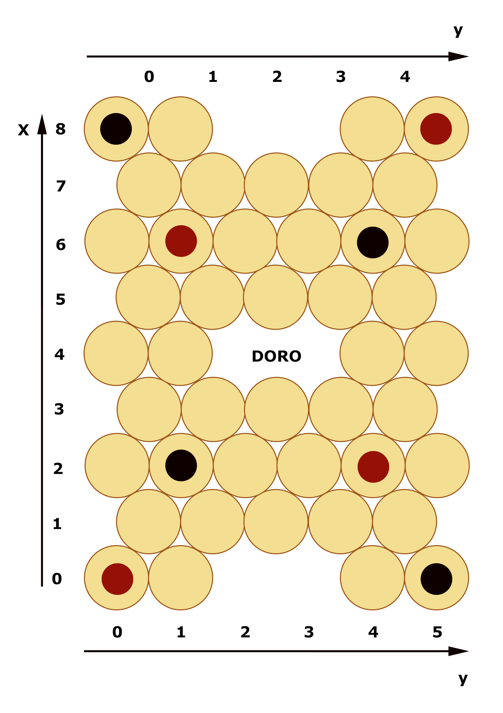
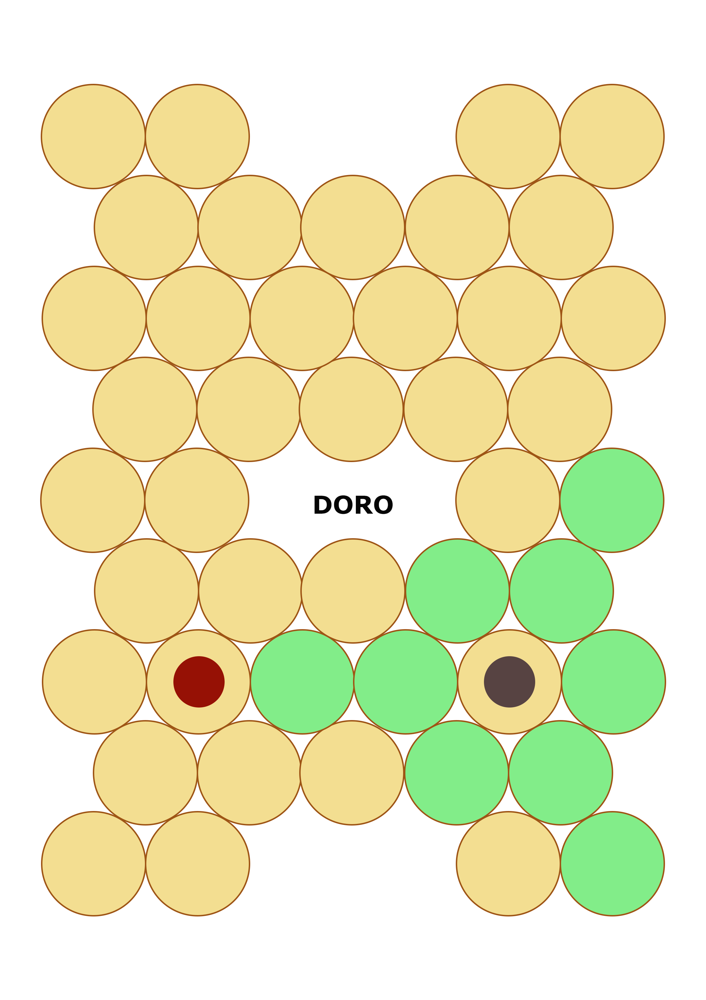
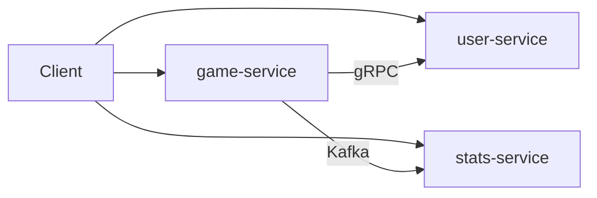

# DoroGame

### Overview
**Доро** - это настольная игра для двух игроков на специальной доске. Цель игры - cоставить все свои фишки в ряд раньше соперника.

**DoroGame** - микросервисное backend приложение на Java для игры в Доро

### Правила игры

Стандартное поле для Доро выглядит следующим образом. У каждого игрока есть 4 фишки, они расставляются как показано на рисунке. 

Приложение работает с координатами клеток x и y, на рисунке показано соотвтетсвие координат клеткам. Предусмотрено добавление новых полей помимо стандратного.


За один ход можно переместить любую свою фишку на любое количество клеток по горизонтали или диагонали. Через свою или чужую фишку переступать нельзя. (Пример доступных ходов показан на рисунке).\
Побежает тот, кто собрал все свои фишки (стардартный вариант) или любые 3 своих фишки (короткий вариант) в ряд раньше соперника.

В приложении по умолчанию установлен стандартный вариант.



### Реализация

DoroGame реализовано как микросервисное backend приложение с взаимодействие через REST API на базе Spring Boot

- Реализовано асинхронное (Kafka) и синхронное (grpc) взаимодействие
- Добавлена авторизация через JWT (Keycloak)
- Использован Outbox Pattern
- Микросервисы построены в гексагональной архитектуре
- В каждом микросервисе настроена база данных Postgres
- Каждый микросервис находится в отдельном контейнере Docker Compose

Схема:


### game-service

Основной микросервис, отвечающий за игровой процесс

Функции:
- управление приглашениями в игру (приватные и публичные)
- управление игровым процессом

### user-service

Отвечает за информацию об игроках

Функции:
- Управляет регистрацией игроков
- Хранит информацию об игроках

### stats-service

Отвечает за статистику игр

Функции:
- Считает рейтинг игроков на основе побед и поражений
- Даёт доступ к стастистике игр

### Workflow

```
- Игроки регистрируются через user-service
- Игрок1 создаёт публичное или приватное приглашение через game-service
- game-service отправляет запрос через grpc и проверяет, что пользователь существует
- Игрок2 принимает приглашение через game-service
- game-service отправляет запрос через grpc и проверяет, что пользователь существует
 и получает его имя
- Создаётся игра и игроки делают ходы по очереди
- После каждого хода вычисляется, победил ли кто-то, и если да, то игра заканчивается
- game-service отправляет событие об окончании игры в stats-service через kafka
- stats-service обновляет рейтинг игроков и статистику побед/проигрышей
```

### Тесты

Работа всех микросервисов покрыта unit тестами (JUnit) и интеграционными тестами (TestContainers)